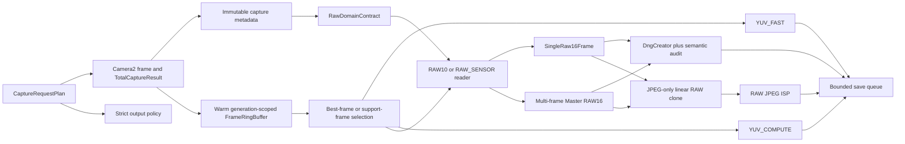

# Imaging Pipeline Architecture

## Product Boundary

`CaptureRoutePlanner` resolves capture mode, frame origin, output policy, profile, camera and
stream capabilities into one concrete route before frame processing starts. Unsupported
contracts fail with a reason; they never substitute a frame origin, output type, render path,
or quality level. RAW-only routes end at DNG export and never invoke the JPEG renderer.

The DNG payload and JPEG working image are different products. `MasterRawFrame.raw16Bytes`
is the DNG source and is never display-tonemapped. Debug builds fingerprint it before and
after JPEG rendering. Native access releases the Java array with `JNI_ABORT`.

## RAW Domain

`RawDomainContract` is the only RAW interpretation contract. It records source packing,
native and payload bit domains, per-CFA black levels, white level, CFA origin, active/crop
arrays, strides, physical lens identity, metadata sources and sample transform. RAW10 is
explicitly unpacked from 4-pixel/5-byte groups; RAW_SENSOR uses reported row/pixel stride and
little-endian 16-bit samples.

## Master And DNG

`RawMasterBuilder` is exclusive to multi-frame RAW routes and creates one right-justified RAW16
payload. Single RAW uses `SingleRaw16FrameBuilder`, which unpacks exactly one selected buffer
without alignment, support-frame selection, accumulation, or the master builder. Multi-frame
shifts are Bayer-phase safe and support frames are bounded by route capacity. `DngWriter` streams the payload to
`DngCreator`. `DngSemanticAuditor` validates payload size/range and real TIFF/DNG tags including
BL/WL, CFA, active/default crop, neutral, matrix, noise, orientation and illuminant.

## JPEG ISP

The RAW JPEG route performs crop/CFA correction, black subtraction, white normalization,
defect and green-split correction, validated lens shading, local highlight reconstruction,
Malvar-He-Cutler demosaic, scene-linear WB/CCM, local highlight rolloff, curves, ISO/noise-model
NR, edge-aware sharpening, sRGB transfer and JPEG encoding. It does not apply global highlight
darkening to the DNG master.

## Camera Control And ZSL

`CameraControlPolicy` resolves Matrix, Center Weighted, Spot/Tap and Highlight Protect into
real Camera2 regions. Partial manual exposure uses the last measured counterpart and never a
fabricated shutter/ISO fallback. Buffers are generation-scoped and invalidated immediately on
lens/profile changes. Single-frame ranking uses pixel sharpness/clipping plus exposure, OIS,
AE/AWB/AF consistency and shutter-relative freshness.

## Performance And Debug

`CaptureBufferBudget` sizes buffers from format, resolution, RAM and process memory class.
MediaStore/EXIF/DNG publication is owned by a bounded single-writer queue after render ownership
has transferred, so capture readiness is not serialized behind storage. Queue saturation and
write failures are explicit failures, with pending entries removed rather than silently lost.
Capture reports include latency, unpack, merge, DNG write, ISP, encode and save timings; sampled
Java/native heap peaks; native working-set estimates; contract dumps; sample percentiles;
clipping; lens-shading state; DNG audit and selected-frame provenance.
